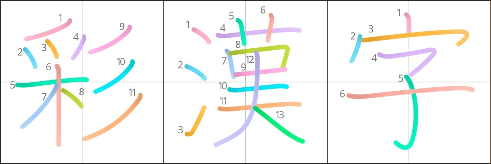

# SaiKanji (彩漢字)

**A vibrant, colorized stroke-order font derived from KanjiVG.**

## Features
- Beautiful multi-colored strokes for better visual learning
- Stroke order information built into the font (great for educational use)
- Based on the high-quality, open KanjiVG dataset
- Supports a wide range of common kanji
- Ideal for Anki decks, websites, learning apps, flashcards, and Japanese study materials

## Preview
*(Insert images or GIFs showing colored strokes here)*

## Installation
1. Download the latest release (`.ttf` or `.woff` file)
2. Install the font on your system or embed it in your project/webpage

## License
This font is licensed under a [Creative Commons Attribution-ShareAlike 4.0 International License](http://creativecommons.org/licenses/by-sa/4.0/).

**You are free to:**
- Use it commercially
- Modify and redistribute it
- Embed it in apps, websites, Anki decks, etc.

**Requirements:**
- Give appropriate credit (see below)
- Share any modifications under the same license

## Attribution
This font is based on data from **[KanjiVG](https://kanjivg.tagaini.net/)**  
© 2009–2026 Ulrich Apel, released under CC BY-SA 3.0.

**Preferred attribution text:**
> "SaiKanji" is derived from KanjiVG by Ulrich Apel (CC BY-SA 3.0) and licensed under CC BY-SA 4.0.

## Contributing
Feel free to open issues or pull requests if you want to help improve SaiKanji!

## Source Projects
- [KanjiVG](https://kanjivg.tagaini.net/) – KanjiVG (Kanji Vector Graphics) provides vector graphics and other information about kanji used by the Japanese language. For each character, it provides an SVG file which gives the shape and direction of its strokes, as well as the stroke order. Each file is also enriched with information about the components of the character such as the radical, or the type of stroke employed.